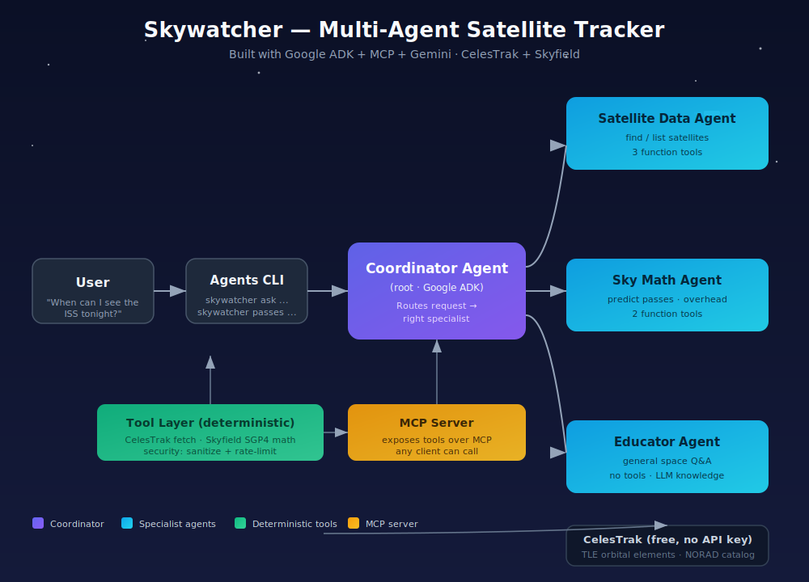

# Skywatcher 🛰️

> A multi-agent AI companion that tracks recently launched satellites, predicts when they'll be visible from your location, and answers your questions about what's overhead.

**Track:** Freestyle · **Built with:** Google ADK · MCP · Gemini · Skyfield · CelesTrak

---

## The Problem

Thousands of satellites orbit Earth — the ISS, Hubble, Starlink trains, newly
launched missions — but answering *"when can I actually see one tonight?"*
still means digging through terse tables on astronomy sites, copying
coordinates, and doing mental math on azimuths and elevations. It's a friction
tax on a moment of wonder.

## The Solution

**Skywatcher** is a small team of AI agents that turns plain-English questions
into real orbital calculations. Ask *"When can I see the ISS from Boulder?"*
and a coordinator agent routes the request to a specialist, which calls real
tools that fetch live Two-Line Element (TLE) data from CelesTrak and propagate
the orbit with Skyfield/SGP4 to predict visible passes — then explains the
result in friendly language.

```
$ skywatcher ask "When can I see the ISS from Boulder?"
Skywatcher: The ISS will make 2 visible passes over Boulder in the next 24h:
  • Best pass: tonight at 21:14 UTC, rising in the SW (az 231°),
    peaking at 88° elevation — almost directly overhead.
  Bring a jacket; it's a bright, easy-to-spot pass. 🌌
```

---

## Architecture



The system is a **coordinator + 3 specialist sub-agents** built on Google's
Agent Development Kit (ADK):

| Agent | Job | Tools |
|-------|-----|-------|
| **Coordinator** (root) | Routes the request to the right specialist | none (delegates) |
| **Satellite Data** | Find/list satellites by name or NORAD id | 3 function tools |
| **Sky Math** | Predict passes & list what's overhead now | 2 function tools |
| **Educator** | Answer general space/orbit questions | none (LLM knowledge) |

The deterministic capability layer lives in `skywatcher/tools/`:
- `celestrak.py` — fetches TLE orbital elements (free, no API key), with TTL cache.
- `sky_math.py` — Skyfield/SGP4 propagation: sub-satellite point, pass prediction, overhead detection.
- `security.py` — input validation, text sanitization, rate limiting.

The same tools are also exposed as an **MCP server** (`skywatcher/mcp_server/`),
so any MCP-compatible client (Claude Desktop, Antigravity, Cursor) can call them.

```
skywatcher/
├── skywatcher/
│   ├── agents/           # Multi-agent system (ADK)
│   │   ├── coordinator.py    # root agent — routes to specialists
│   │   ├── specialists.py    # 3 sub-agents + their tools
│   │   └── runner.py         # executes a conversation
│   ├── mcp_server/       # MCP server exposing the tools
│   │   └── server.py
│   ├── tools/            # deterministic capability layer
│   │   ├── celestrak.py      # TLE fetch
│   │   ├── sky_math.py       # orbital math (Skyfield)
│   │   └── security.py       # validation, sanitization, rate-limit
│   ├── cli.py            # Agents CLI (click + rich)
│   └── config.py         # env-driven settings
├── tests/                # unit tests (no API key needed)
├── Dockerfile            # deployable container
├── docker-compose.yml
└── docs/architecture.svg
```

---

## Course Concepts Demonstrated

The capstone requires at least **3** of the 6 course concepts. Skywatcher
demonstrates **all 6**:

| Concept | Where | How |
|---------|-------|-----|
| **Agent / Multi-agent (ADK)** | `skywatcher/agents/` | Coordinator + 3 specialist sub-agents built on `google.adk.agents.Agent` |
| **MCP Server** | `skywatcher/mcp_server/server.py` | FastMCP server exposing 5 tools + a resource, runnable via `skywatcher mcp serve` |
| **Antigravity** | Video | Developed & run inside the Antigravity IDE; shown in the demo video |
| **Security features** | `skywatcher/tools/security.py` | Coordinate validation, text sanitization, prompt-injection heuristics, rate limiting, env-only secrets, no PII persistence |
| **Deployability** | `Dockerfile`, `docker-compose.yml`, video | One-command Docker deploy; reproducible container image |
| **Agent skills (CLI)** | `skywatcher/cli.py` | `skywatcher` CLI with `ask`, `passes`, `overhead`, `list-sats`, `find`, `mcp serve` subcommands |

---

## Setup

### Prerequisites
- Python 3.10+
- A free **Google Gemini API key** — get one at <https://aistudio.google.com/apikey>

### Install

```bash
git clone <your-repo-url> skywatcher
cd skywatcher
pip install -e .

cp .env.example .env
# edit .env and paste your GEMINI_API_KEY
```

### Verify (no API key needed)

The deterministic tools and tests run without a key:

```bash
pytest -q                       # 14 tests pass
skywatcher list-sats -c visual  # lists bright satellites (needs internet)
```

---

## Usage

### 1. Natural-language agent (needs `GEMINI_API_KEY`)

```bash
skywatcher ask "When can I see the ISS from New York?"
skywatcher ask "What does the Hubble Space Telescope do?"
skywatcher ask "List satellites launched in the last 30 days"
skywatcher ask --interactive    # chat session
```

### 2. Deterministic commands (no API key)

```bash
skywatcher list-sats -c starlink        # Starlink constellation
skywatcher find "Hubble"                # lookup by name
skywatcher passes "ISS" --lat 40.71 --lon -74.00 --hours 48
skywatcher overhead --lat 40.71 --lon -74.00
```

### 3. MCP server (for Claude Desktop, Antigravity, Cursor, …)

```bash
skywatcher mcp serve
```

Then point your MCP client at this server. Example Claude Desktop config:

```json
{
  "mcpServers": {
    "skywatcher": { "command": "skywatcher", "args": ["mcp", "serve"] }
  }
}
```

### 4. Docker (deployability)

```bash
docker build -t skywatcher .
docker run --rm -e GEMINI_API_KEY=your_key skywatcher ask "What's overhead right now from London?"
# or via compose:
docker compose run --rm agent ask "When can I see the ISS?"
```

---

## How It Works (technical)

1. **TLE fetch** — `celestrak.py` pulls Two-Line Element sets from CelesTrak's
   free JSON endpoint, cached for 2h (CelesTrak's own update cadence) and
   rate-limited to ≤20 calls/min to respect fair-use.
2. **Orbit propagation** — `sky_math.py` uses Skyfield's `EarthSatellite`
   (SGP4 propagator) to compute the sub-satellite point and `find_events()` to
   detect rise/culminate/set events above a 10° elevation threshold.
3. **Multi-agent routing** — the Coordinator's prompt teaches it to delegate:
   pass-prediction → Sky Math agent, lookups → Satellite Data agent, facts →
   Educator agent. ADK handles the sub-agent tool-calling.
4. **Security boundary** — every coordinate is validated/clamped at the trust
   boundary; every free-text query is sanitized (control-char strip, length
   cap, injection heuristics); no location or personal data is persisted.

---

## Testing

```bash
pip install -e ".[dev]"
pytest -q
```

Tests cover the security validators and the orbital math using a synthetic
TLE — they run **fully offline** and **without an API key**.

---

## Security Notes

- **No secrets in code.** The only key (`GEMINI_API_KEY`) is read from the
  environment. `.env` is gitignored.
- **No PII storage.** Observer location is used ephemerally for a calculation
  and discarded. Sessions are in-memory only.
- **Input validation.** Coordinates are range-checked and NaN/inf-rejected;
  user text is control-char-stripped and length-capped.
- **Rate limiting.** Outbound calls to the free CelesTrak service are capped.

---

## Credits & Data Sources

- [CelesTrak](https://celestrak.org/) — free TLE orbital data (no API key).
- [Skyfield](https://rhodesmill.org/skyfield/) — SGP4 propagation & astronomy.
- [Google Gemini](https://aistudio.google.com/) — the agent LLM.
- [Google ADK](https://google.github.io/adk-docs/) — Agent Development Kit.
- [MCP](https://modelcontextprotocol.io/) — Model Context Protocol.

## License

MIT — see [LICENSE](LICENSE).
